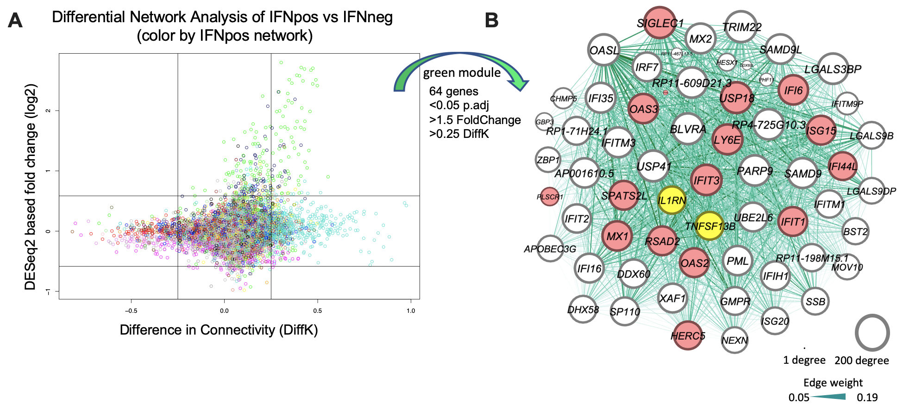
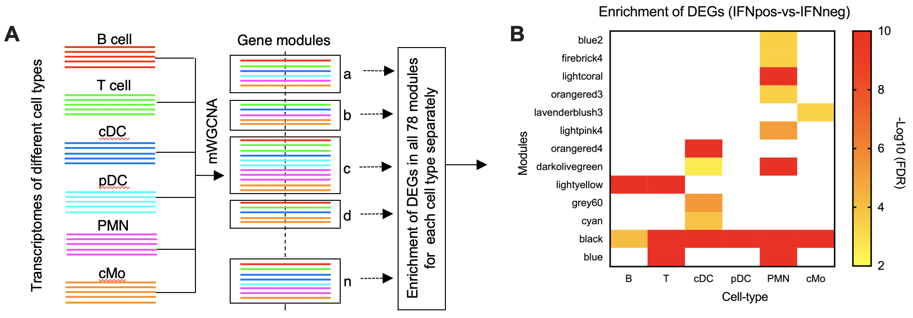

# SLE-mWGCNA

## Multi-cell type gene co-expression network analysis reveals coordinated interferon response and cross cell-type correlations in SLE

### This repository contains all R scripts for Differential Network Analysis (IFNpos-vs-IFnneg) and multi cell type WGCNA (mWGCNA).

Please Cite: https://www.biorxiv.org/content/10.1101/2020.04.27.065227v2

Systemic lupus erythematosus (SLE) is an incurable autoimmune disease disproportionately affecting women and may lead to damage in multiple different organs. The marked heterogeneity in its clinical manifestations is a major obstacle in finding targeted treatments and involvement of multiple immune cell types further increases this complexity. Thus, identifying molecular sub-types that best correlate with disease heterogeneity and severity as well as deducing molecular cross-correlation among major immune cell types that lead to disease progression are critical steps in development of more informed therapies for SLE. Here we profile and analyze gene expression of six major circulating immune cell types from patients with well-characterized SLE (classical monocytes (n=64), T cells (n=24), neutrophils (n=24), B cells (n=20), conventional (n=20) and plasmacytoid (n=22) dendritic cells) and from healthy control subjects.  Our results show that the interferon (IFN) response signature was the major molecular feature that classified SLE patients into two distinct groups: IFN-signature negative (IFNneg) and positive (IFNpos). We show that the gene expression signature of IFN response was consistent (i) across all immune cell types, (ii) all single cells profiled from three IFNpos donors using single-cell RNA-seq, and (iii) longitudinal samples of the same patient. For a better understanding of molecular differences of IFNpos versus IFNneg patients, we combined differential gene expression analysis with differential Weighted Gene Co-expression Network Analysis (WGCNA), which revealed a relatively small list of genes from classical monocytes including two known immune modulators, one the target of an approved therapeutic for SLE (*TNFSF13B/BAFF*: belimumab) and one itself a therapeutic for Rheumatoid Arthritis (*IL1RN*: anakinra) **(Figure 1)**. 

**Figure 1: Combined analysis of differential network and gene expression of classical monocytes reveals two known immune modulators (BAFF and IL1RN).** **(A)** The plot shows both differentially expressed (DEGs) and connected genes (DCGs) between IFNpos and IFNneg where the X-axis is the difference in the connectivity (DiffK = K1-K2; K1=connectivity in IFNpos network; K2=connectivity in IFNneg network) and the Y-axis is the DESeq2 based fold-change (log2). Colors of genes represent different modules based on the IFNpos (Network1) based network. **(B)** 64 genes were selected from the green module using significant DEGs (p.adj < 0.05; 1.5-fold change) as well as DCGs with at least 0.25 difference in connectivity (DiffK) and visualized by Gephi software. Where nodes are sized according to the number of edges (connections), and the edge thickness is proportional to the strength of co-expression. Available IFN signature genes (IFN-20) are highlighted in red colors and two known immune modulators (*IL1RN* and *BAFF* (*TNFSF13B*)) are highlighted in yellow. 

For a more integrative understanding of the cross-correlation among different cell types and to identify potentially novel gene or pathway connections, we also developed a novel gene co-expression analysis method for joint analysis of multiple cell types named as multi cell type WGCNA (mWGCNA) **(Figure 2)**. This method revealed an interesting cross-correlation between T and B cells highlighted by a significant enrichment in the expression of known markers of T follicular helper cells (Tfh), which also correlate with disease severity in the context of IFNpos patients. Interestingly, higher expression of *BAFF* from all myeloid cells also shows a strong correlation with enrichment in the expression of genes in T cells that may mark circulating Tfh cells or related memory cell populations. These cell types have been shown to promote B cell class-switching and antibody production, which are well-characterized in SLE patients. 

**Figure 2: An overview of multi cell type WGCNA (mWGCNA) approach.** **(A)** A figure depicting the mWGCNA analysis using combined transcriptomes from six different cell types. **(B)** We found 13 modules (out of total 78) that have significant enrichment of DEGs (IFNpos-vs-IFNneg) in at least one cell type. The X-axis shows modules with their enrichment in each cell type and Y1-axis shows -Log10 value of FDR (based on hypergeometric test). This includes four modules (black, blue, lightyellow, and darkolivegreen) where the DEGs are significantly enriched in two or more cell types. We have selected two modules (black and lightyellow) that we used for further analysis. Modules are sorted based on their increasing module size (showing as black dash on the Y2-axis).

In summary, we generated a large-scale gene expression dataset from sorted immune cell populations and present a novel computational approach to analyze such data in an integrative fashion in the context of an autoimmune disease. Our results reveal the power a hypothesis-free and data-driven approach to discover drug targets and reveal novel cross-correlation among multiple immune cell types specific to a subset of SLE patients. This approach is immediately useful for studying autoimmune diseases and is applicable in other contexts where gene expression profiling is possible from multiple cell types within the same tissue compartment.

### How to use it?

We used R package WGCNA (v1.61) for analysis and provided R history files of mWGCNA (mWGCNA.Rhistory) and Differential Network Analysis between IFNpos and INFneg (DifferentialNetworkAnalysis.Rhistory) in corresponding folders. All required input files (mainly gene expression and clinical information files) are provided in the folder.

mWGCNA input files: ExpressionProfilesTPM1.csv, ClinicalTraits.csv

Differential Network Analysis input files: FirstVisitExpressionProfiles.csv, FirstVisitClinicalTraits.csv

Please install follwoing R libraries:
library(WGCNA)
library(MASS)	# standard, no need to install
library(class)	# standard, no need to install
library(cluster)
library(impute)# install it for imputing missing value
library(scatterplot3d)

For details, please use standard WGCNA tutorials (https://horvath.genetics.ucla.edu/html/CoexpressionNetwork/Rpackages/WGCNA/Tutorials/) or Differential Network Analysis tutorial (https://horvath.genetics.ucla.edu/html/CoexpressionNetwork/DifferentialNetworkAnalysis/).
